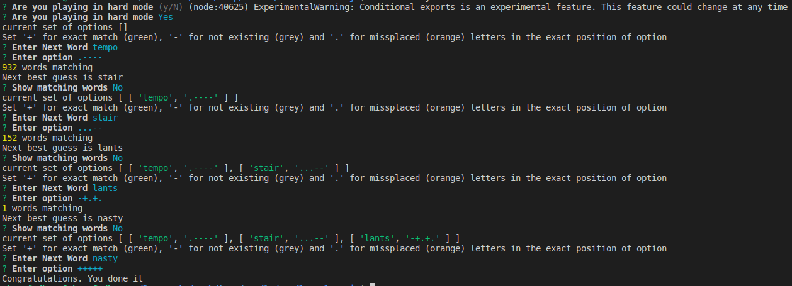
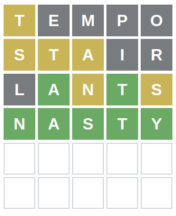
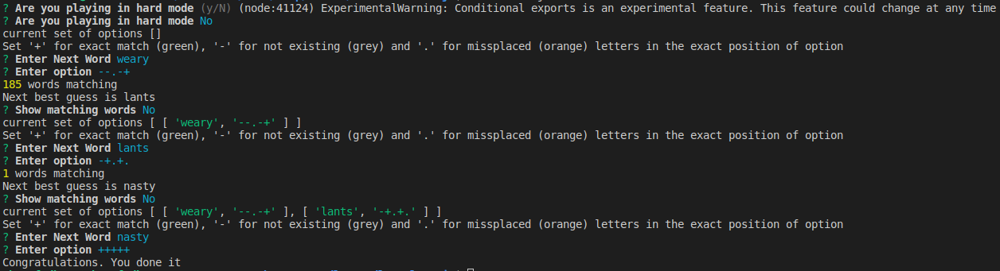
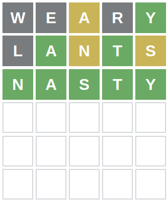

# Wordle Solver (JavaScript)

A tool to help you win the wordle game. This tool provides a best guess word and a set of candidate words for each step . You are still the player and its your call to choose which word you want to enter.

### Setup

```sh
npm i
```

### Run

```sh
node index.js
```

### How to use

1. Choose hard mode or not
2. Start with a random word
3. Add the word in the prompt with option

---
` Set '+' for exact match (green), '-' for not existing (grey) and '.' for missplaced (orange) letters in the exact position of option `
---

For example: if `tempo` is typed and `t` is shown as `orange` and `e` shown as `green` and all others are grey, then the option should be `.+---`

4. Get the best guess word and enter it in the game
5. repeat 4 & 5 till you get the correct word

## Examples

### Hard mode






### Non-hard mode




