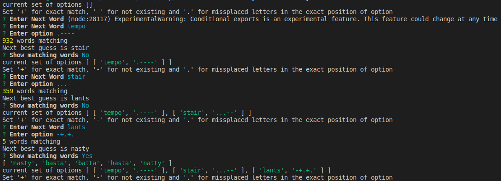
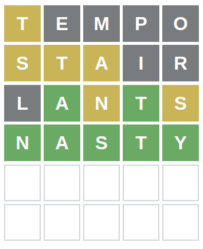

# Wordle Solver (JavaScript)

### Setup

```sh
npm i
```

### Run

```sh
node index.js
```

### How to

1. Start with a random word
2. Add the word in the prompt with option

` Set '+' for exact match (green), '-' for not existing (grey) and '.' for missplaced (orange) letters in the exact position of option `

For example: if `tempo` is typed and `t` is shown as `orange` and `e` shown as `green` and all others are grey, then the option should be `.+---`

### Example




